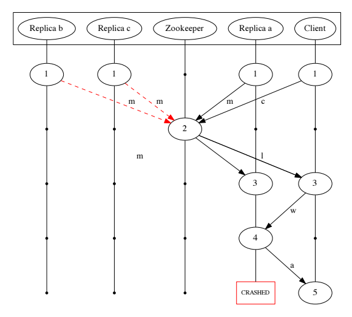
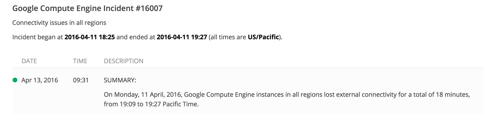

- title : Lord of Chaos - Becoming a Chaos Engineer
- description : Lord of Chaos - Becoming a Chaos Engineer
- author : Nikolai Norman Andersen
- theme : night
- transition : default

***

<!-- Our software systems are becoming more complex and more distributed. How do we have confidence in the resilience and redundancy of the systems we put in production? Chaos Engineering is the practice of introducing failures into your system in controlled experiments to learn how your system reacts. In this talk we will look into how to establish the steady state behavior of a system and how to start experimenting to discover if the system can handle spikes in traffic, failures and timeouts. -->

# Lord of chaos

## Becoming a Chaos Engineer

' * High everyone
' * My name is Nikolai Norman Andersen, .NET competency lead at BEKK
' * Polyglot programming and common tools and services are now de facto standard.
' * powerfull tool for every developer in a DevOps culture
' * Wheel of Time reference

***

### <a href="https://radar.bekk.no/tech2016/arkitektur-og-plattform" data-preview-link>BEKK Radar</a>

' * Recommended because they solve a lot of of problems regarding scalability and availability
' * Moving away from the old monolitich ways of doing things, new non-functional demands our customers give us
' * Solves a problem, but introduces more?

---

#### The simple act of logging

```
Application
|> Loggingframework
|> Local RabbitMQ instance
|> Federated downstream RabbitMQ instance
|> Logstash Instance One
|> File ( |> Backup on fileshare )
|> Logstash Instance Two
|> ElasticSearch
|> Kibana
````

' Network failure to elasticsearch?
' Put back on the queue, retries!?
' Elasticsearch is not recommended as primary storage
' Brain split!!!?
' Kibana request not responding resharding
' 99% CPU. Two minutes to answer. Failure or latency?
' Why not straight to Elasticsearch? -> We experienced network failues
' Less errors with this complex stack

---

### Distributed systems are complex

' Network communication / Netsplits
' Delay vs Failure -> Impossible to seperate
' Leader election, data replication
' Moving parts
' Configuration
' Possible failures
' Concepts to understad, like Service discovery and Circuit breakers
' Trivial systems vs alarms etc -> Nuclear reactor -> Formal methods

<!-- Our software systems are becoming more complex and more distributed. Microservices has become a household word, and many greenfield projects starts with small services from scratch. While it gives a lot opportunities, especially when it comes to scaling, polyglot solutions and maintenance, it also gives us a new set of problems: More network communication and more moving parts. We have a lot more configuration and we need to gracefully handle failures. Most likely we need service discovery and we are probably using a circuit breaker or two. This is getting complicated, but we get it working. -->

---

### DON'T ROLL YOUR OWN!

' ZooKeeper / Seal of Approval

---

### Putting components together is hard

' Both doing what they were ment to do, but fucking each other over 
' ZooKeeper Kafka bug found by Kyle Kingsbury (Has been fixed)

---




<small>
https://aphyr.com/posts/293-call-me-maybe-kafka
<br/>
https://people.eecs.berkeley.edu/~palvaro/molly.pdf
<br/>
http://blog.empathybox.com/post/62279088548/a-few-notes-on-kafka-and-jepsen
</small>

' * Partition
' * It claimed tolerance to F-1 failures, but a single node could cause catastrophe
' * Both Zookeeper and primary/backup replication are individually correct software components
' * writes are not replicated prior to acknowledgement
' * Message loss failure followed by node failure
' * candidate design

---

### CAP Theorem

- Consistency
- Availability
- Partition Tolerance

' * Consistency - A read is guaranteed to return the most recent write for a given client.
' * Availability - A non-failing node will return a reasonable response within a reasonable amount of time (no error or timeout).
' * Partition Tolerance - The system will continue to function when network partitions occur.

---

#### Even Google goes down!



' Salesforce: Three-and-half-hours of data has evaporated
' Azure DNS: Unavailable instances

***

### What is Chaos Engineering

' Different kinds of tests
' Smoke tests are black boxes, what went wrong?
' Experiments

---

> Chaos Engineering is the discipline of experimenting on a distributed system
in order to build confidence in the system’s capability
to withstand turbulent conditions in production.

<!-- And why is this so important now? Right now I'm supposed to be at my desk to make sure National Tests in Norway are going as expected -->

' controlled burn - netflix qcon talk
' We are triggering failures when we are prepared and ready to react
' collecting data
' take node down, run smoketest, six seconds longer. Test pass but is it ok?
' Steady state! What is that?

***

<!-- But how do we trust that all our failure handling will work as expected? How can we be sure that our autoscaling works? -->

### Embrace Chaos

<!-- We use unit tests to make sure our logic is sound, integration tests to test how our modules and systems work together and smoke tests to test more realistic scenarios when our solution is deployed to a environment with similarities to production. However we all know there are bugs or situations that will only occur in production, either because of the data or because of the load. Chaos Testing is a response to all of this. By injecting failures in a controlled experiment we can see how our system handles them. And we do it the only place where it matters: In production! And before you jump out of your chair to yell “Testing in production!? That’s crazy!”, let me tell you a bit more about Chaos Testing in practice: Chaos Testing, or Chaos Engineering, is not about fucking yourself over. It’s about finding weaknesses before they manifest, and to automate the process so you can, at any time - and after any change - be certain that your infrastructure and system can handle failures. -->

http://principlesofchaos.org/

---

#### Principles

1. Define ‘steady state’
1. Hypothesize that this state continues during failure
1. Introduce failures
1. Try to disprove hypothesis

' 1. Start by defining ‘steady state’ as some measurable output of a system that indicates normal behavior.
' 1. Hypothesize that this steady state will continue in both the control group and the experimental group.
' 1. Introduce variables that reflect real world events like servers that crash, hard drives that malfunction, network connections that are severed, etc.
' 1. Try to disprove the hypothesis by looking for a difference in steady state between the control group

---

#### Advanced Principles

1. Build a Hypothesis around Steady State Behavior
1. Vary Real-world Events
1. Run Experiments in Production
1. Automate Experiments to Run Continuously

' * Measurable output over time. Throughput, error rates, latency percentiles 
' * hardware failures: servers dying, malformed responses. N
' * Non-failure events like a spike in traffic or a scaling event
' * Traffic patterns. Authenticity and relevance.
' * Automate everything

***

### Lineage-driven Fault Injection

[Lineage-driven Fault Injection Paper](https://people.eecs.berkeley.edu/~palvaro/molly.pdf)

[QCon 2016: Monkeys in Lab Coats: Applying Failure Testing Research @Netflix](https://www.infoq.com/presentations/failure-test-research-netflix)
<br/>
<br/>
<small>

</small>
' * Paper - Molly - QCon together with Amazon
' * data lineage -> directly connect system outcomes to the data and messages that led to them
' * "Why did a good thing happend" - "What could have gone wrong along the way?"
' * Works it way backwards and finds proofs to why it happens, tries to disprove
' * The Rules: "the adversary agrees to crash no more than one node, and to drop messages only up until some fixed time"
' * A lineagedriven fault injector reasons backwards from correct system outcomes to determine whether failures in the execution could have prevented the outcome.
' * Formal methods
' * Random shots in the dark fault injection

***

### Chaos Engineering in the wild

---

### Netflix - The Simian Army
https://github.com/Netflix/SimianArmy <!-- Chaos Monkey -->

<!-- is a suite of tools for keeping your cloud operating in top form. Chaos Monkey, the first member, is a resiliency tool that helps ensure that your applications can tolerate random instance failures -->

' Chaos Monkey -> Daytime
' Janitor Monkey
' Conformity Monkey

---

### Microsoft - Azure Search
https://azure.microsoft.com/nb-no/blog/inside-azure-search-chaos-engineering/

---

### WazMonkey
https://github.com/smarx/WazMonkey

```
// choose one at random
var instance = instances[new Random().Next(instances.Length)];

// reboot it
req = HttpWebRequest.Create("CloudProviderApi.com", ...);
req.Method = "POST";
req.ContentLength = 0;
req.Headers["x-ms-version"] = "2012-03-01";
req.ClientCertificates.Add(cert);

// make sure the response was "accepted"
var response = (HttpWebResponse)req.GetResponse();
```

---

### Jepsen
https://aphyr.com/tags/jepsen

' Kyle Kingsbury

***

### How to start

' Remote desktop / SSH into a machine and stop a service
' Public cloud APIs -> Write a script
' Monitoring to capture metrics

---

### Predictable outcomes

```
let yourApplication request =
    Process request
    |> response
```

' Your system as a pure function
' data lineage -> directly connect system outcomes to the data and messages that led to them
' Functional language easier to reason about code, same with modules
' Why microservices is good, why stateless is good

---

### Selective test cases

' "Why did a good thing happend"
' Bottom up over top down
' Not even a formal system can test all cases?
' Mindset

***

# Let the Lord of Chaos Rule
## Questions?


<br/>twitter: [@nikolaiii](https://twitter.com/nikolaiii)
<br/>slides: https://nikolaia.github.io/lord-of-chaos-slides/
